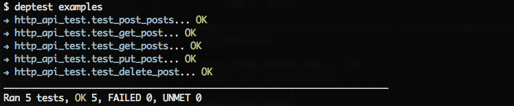
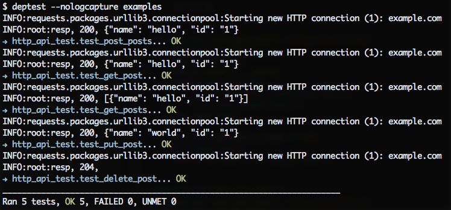

# Deptest

Deptest is a testing framework to handle situation when your need to control
the execution order of the test units. Seriously, deptest does not follow
the of unit testing, in other words, using this tool means
you are thinking againest the philosophy of unit testing:
“to isolate each part of the program and show that the individual parts are correct”.

But so what? Programming needs diversity, so does testing methodology.
If the situation really exists, we shouldn't pretend not to see,
that's why deptest is created, it could be considered as a different
approach to organize your tests. Try it if you are stuck with unit testing,
maybe it'll be helpful :)

## Installation

    pip install deptest

## Usage

The core part of using deptest is to use `depend_on` decorator on your test functions. `depend_on` describes that a test function should be run if and
only if its **dependency** is `OK`. If dependency is `FAILED`, then the
test function will not be executed and the status will be set to `UNMET`.

1. Case 1, simple dependency

    ```python
    from deptest import depend_on

    @depend_on('test_b')
    def test_a():
        print 'a, depend on a'

    def test_b():
        print 'b'
    ```

    This will ensure `test_a` run after `test_b` even though `test_a` is defined before `test_b`.

2. Case 2, passing return value

    ```python
    from deptest import depend_on

    @depend_on('test_b', with_return=True)
    def test_a(name):
        print 'a, depend on', name

    def test_b():
        print 'b'
        return 'b'
    ```

    With `with_return` argument set to `True`, the return value of `test_b`
    will be passed into `test_a`. By default return values of dependencies
    won't be passed.

2. Case 3, complicated dependencies

    ```python
    from deptest import depend_on

    @depend_on('test_c', with_return=True)
    @depend_on('test_b', with_return=True)
    def test_a(name1, name2):
        print 'a, depend on', name1, name2
        return 'a'

    @depend_on('test_d')
    def test_b():
        print 'b'
        return 'b'

    @depend_on('test_d')
    def test_c():
        print 'c'
        return 'c'

    def test_d():
        print 'd'
        return 'd'
    ```

    The dependent graph of the four functions will be:

    ```
    d
    | \
    b  c
    | /
    a
    ```

    Thus the execute sequence will be `d, b, c, a` or `d, c, b, a`, the results are fairly the same.

    ```
    $ deptest -s test/simple_test.py
    d
    → simple_test.test_d... OK
    b
    → simple_test.test_b... OK
    c
    → simple_test.test_c... OK
    a, depend on b c
    → simple_test.test_a... OK
    ______________________________________________________________________
    Ran 4 tests, OK 4, FAILED 0, UNMET 0
    ```

You can see some practical examples in [`examples/`](examples) folder,
It's worth mentioning that `http_api_test.py` simulates an HTTP API testing case, which is mostly the reason why I develop this tool.

Deptest provides a cli command also called `deptest`, it supports some common
arguments of `nosetests`, like `-s` and `--nocapture`, see detail usage by `deptest -h`:

```
usage: deptest [-h] [-s] [--nologcapture] [--dry] [--debug] [PATH [PATH ...]]

positional arguments:
  PATH             files or dirs to scan

optional arguments:
  -h, --help       show this help message and exit
  -s, --nocapture  Don't capture stdout (any stdout output will be printed
                   immediately)
  --nologcapture   Don't capture logging
  --dry            Dry run, only show matched files
  --debug          Set logging level to debug for deptest logger
```

## Screenshots

See it in action, run `deptest examples`:



With `--nologcapture` argument:


